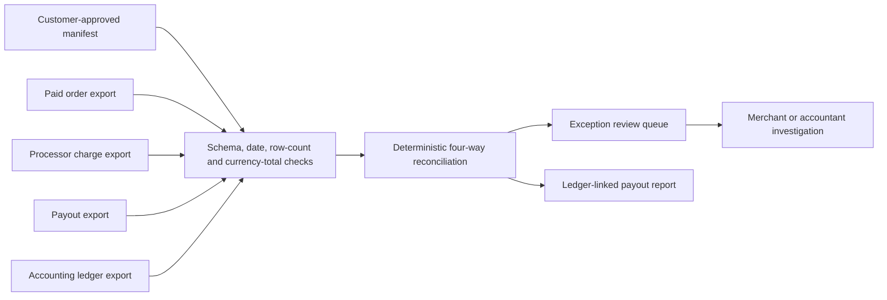

# A2Z Commerce Cash Control

**Read-only order → processor charge → payout → accounting ledger reconciliation.**

Commerce teams often have several accurate systems and no single answer to a practical question: *which paid orders made it through settlement and into the books, and which links need a person to investigate?* This repository provides a small, reproducible reconciliation engine for customer-approved CSV exports. Its first release checks one closed order month, validates declared source row counts and currency totals, and produces a review queue.

> **Scope today:** local CLI, deterministic matching, fictional fixture, tests and CI. There is no Shopify, Stripe or QuickBooks connection; no merchant login; no hosted tenant; no write-back. A ledger-linked payout is not independently bank-confirmed cash, and an exception is not necessarily lost revenue.

**New: [A2Z CloseOps firm pilot](docs/CLOSEOPS.md).** A `closeops run` command evaluates several customer manifests in one atomic local run, stores each client report in its own folder, and creates a firm-level exception index. `closeops reviews` validates manually edited queues and counts operator-declared decisions. It is a local workflow, not authenticated multi-tenant SaaS.

**New: [CloseOps Connect Stripe payout bridge](docs/STRIPE_BRIDGE.md).** A GET-only connector can snapshot one authorized automatic payout and its balance transactions. The offline normalizer emits charge and payout CSVs **only** when the entire paid USD payout is representable by mapped positive charges. Refunds, disputes, reserves, conversions and incomplete payouts are held rather than misrepresented. The checked-in example is fictional; no live merchant account was accessed.

**New: [CloseOps Accountant Desk](docs/ACCOUNTANT_DESK.md).** `closeops-desk` opens an offline desktop interface for selecting local source files, creating client and firm manifests, running a firm close, reviewing exceptions, and exporting an operator-declared review summary. No browser server or cloud account is involved. A Python build with Tkinter is required.

## Run the fictional example

```bash
python -m pip install -e .
cash-control examples/manifest.json --output-dir /tmp/a2z-cash-control-demo
python -m unittest discover -s tests -v
```

Alternatively, without installing: `PYTHONPATH=src python -m cash_control.cli examples/manifest.json --output-dir /tmp/a2z-cash-control-demo`.

The example contains three paid orders. Two charges total USD 150.00 gross; USD 5.00 of processor fees leave a USD 145.00 payout that links to a USD 145.00 ledger entry. The third fictional order lacks a processor charge and enters the review queue. The report separates **ledger-linked payout** from **exceptions**; it never calls the latter recovered revenue. All example IDs and amounts are fictional.

The command writes `report.json` and `review-queue.csv`. It refuses to overwrite a prior run. The queue has blank reviewer, decision, date and notes columns for finance to complete in its own controlled process. Those review entries are **not authenticated or ingested by this release**.

## Architecture



The manifest contains a pseudonymous `customer_key`, a closed `YYYY-MM` order period, an `as_of` date, and the four source paths. Each source declares a row count and total by currency. Orders must be paid inside the declared month; other source dates must be no later than `as_of`. Input hashes record exactly which files produced a report. These controls detect some truncated or altered exports, but they **cannot attest source-system completeness or authenticity**.

The engine verifies exact IDs, currency, gross amount, fee arithmetic, charge net aggregation into a payout, payout amount and timing, and a single matching ledger entry. Missing, duplicated, inconsistent or out-of-order links become explicit exceptions. Matching is conservative: one charge per order, one ledger entry per payout, and no currency conversion.

## Pilot and production path

1. Obtain one merchant's authorization for read-only exports and written definitions for transaction scope, cutoff, fees and ledger accounts. Keep all real exports in customer-controlled storage. `customer-data/` and `pilot-runs/` are ignored by Git, but operators must still manage local access, encryption and retention.
2. Run one closed month. Have finance verify every exception and sample matched transactions against its source systems. Measure false alarms, missed exceptions, reviewer minutes and time to close.
3. Add **one** authenticated read-only integration after validating the provider's data semantics. Reconcile refunds, chargebacks, multi-capture orders, split payouts and reserve movements as distinct transaction types; this release deliberately excludes them.
4. Only then build hosted tenant isolation, authenticated review, scheduled runs, source refresh, monitoring, billing and support. A marketplace app requires its own platform review and is not part of this release.

The open-source layer should retain the normalized file contracts, matching engine, local runner, synthetic fixtures and tests. A commercial service can maintain authorized connectors, secure workspaces, recurring reconciliation, accountant collaboration and support. Pricing should follow measured merchant value and service cost from real pilots, not this synthetic example.

This project complements [Autonomous Order-to-Cash Revenue Assurance](https://github.com/AAH20/autonomous-order-to-cash-revenue-assurance): that engine investigates fulfilled-but-uninvoiced orders, while Cash Control follows paid commerce orders through processor settlement and ledger posting. A2Z SOC's broader commercial entry point is [a2zsoc.com](https://a2zsoc.com/).

## Data handling and claims

No credentials are needed. No network calls occur. Never commit real customer exports, IDs or reports. Treat an exception as a question for finance, not proof of missing cash; treat a ledger link as an accounting record, not independent bank settlement. There is no causal recovery calculation or fee basis in this code.
