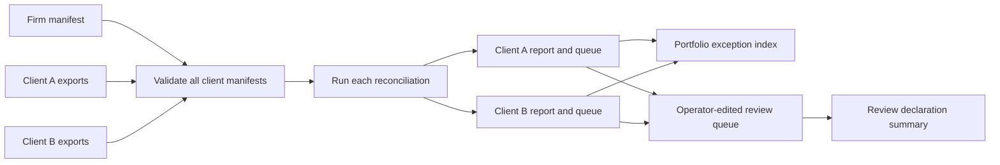

# A2Z CloseOps: local accounting-firm pilot

CloseOps is the first portfolio workflow built on Commerce Cash Control. One firm can run the same closed-period reconciliation for multiple consenting clients without merging their transaction files or treating one client's ledger-linked payout as another's. The example contains two fictional stores.



## Reproduce

```bash
python -m pip install -e .
closeops run examples/firm/manifest.json --output-dir /tmp/a2z-closeops-demo
closeops reviews /tmp/a2z-closeops-demo --output /tmp/a2z-closeops-reviews.json
```

`portfolio.json` lists each pseudonymous client, its exception counts, and ledger-linked payouts by currency. `clients/<client_key>/report.json` and `review-queue.csv` remain separate. The fictional example has one exception for `fictional-store` and none for `second-store`. The reviewer fields start blank, so the initial review summary counts the one exception as `unreviewed`.

An accountant may edit a client's `review-queue.csv` and run `closeops reviews` again to write a **new** review summary path. Allowed decisions are `confirmed_issue`, `false_alarm`, `needs_source`, and `operator_declared_resolved`. The last requires notes. The tool checks that every original exception appears once, rejects unknown or duplicate entries, and requires a reviewer name and date for every decision. Names and decisions are operator-supplied text: this release does **not** authenticate people or verify that an issue was resolved. Keep a reviewed queue and each summary under the firm's own file access and retention controls.

Before creating output, `closeops run` validates all clients and requires that each manifest's customer key and period match the firm declaration. Reports are staged then moved into place. A failed preflight produces no run folder. Existing run and review-summary destinations are never overwritten. Folder separation is for local workflow clarity; it is **not tenant isolation**.

## Pilot measure and release gates

Run one firm with three consenting merchant clients for two closed months. Record setup hours per client, exception precision from reviewed samples, missed exceptions from a sample of matched transactions, reviewer minutes per exception, and whether the firm repeats the workflow for month two. These are planned field measurements, not results in this repository. Do not claim recovered cash from the report's ledger-linked payout metric.

Before a hosted service: authenticate firm and client users, enforce tenant isolation and role access, encrypt data, manage retention, verify connector permissions and source coverage, make review decisions append-only and attributable, add scheduled runs and operational monitoring, and define contracts and support. Any QuickBooks, Xero, Shopify or Stripe integration needs explicit customer authorization and provider-specific mapping tests. The open-source boundary remains the local input contract, deterministic engine, firm orchestration, fictional fixtures and tests; managed connectors and firm operations can become a commercial layer only after pilots show repeat use.
