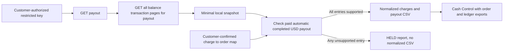

# CloseOps Connect: read-only Stripe payout bridge

This first connector removes one manual export step for a consenting merchant. It does **not** authorize itself, connect to QuickBooks, or prove bank settlement. The repository contains a fictional Stripe-shaped snapshot and tests, not customer data or evidence of a live pilot.



Stripe's [payout balance-transaction filter](https://docs.stripe.com/api/balance_transactions/list) applies to automatic payouts. Its [payout object](https://docs.stripe.com/api/payouts/object) exposes `automatic`, `status` and `reconciliation_status`. The adapter uses only `GET /v1/payouts/{id}` and paginated `GET /v1/balance_transactions?payout={id}` against `api.stripe.com`. It uses an environment-provided `STRIPE_RESTRICTED_KEY`; give that key read access only to the needed resources in the merchant's Stripe account. The code does not create or update any Stripe objects.

## Reproduce the fictional normalization

```bash
python -m pip install -e .
stripe-bridge normalize examples/stripe/automatic-payout-snapshot.json \
  examples/stripe/charge-order-map.csv --output-dir /tmp/a2z-stripe-demo
```

The fictional snapshot has a USD 145.00 automatic payout made from two positive charges with USD 5.00 in fees. Its `ch_demo1 → O1` and `ch_demo2 → O2` mapping is **merchant-supplied example data**, not inferred from Stripe. The command emits `normalization.json`, `charges.csv` and `payouts.csv`. Those two CSVs satisfy Cash Control's v1 source contract. The tests also run them through the existing reconciliation engine alongside fictional orders and ledger entries.

To fetch a **customer-authorized** payout, load a restricted read-only key through your secret manager into `STRIPE_RESTRICTED_KEY`, then run:

```bash
stripe-bridge fetch po_CUSTOMER_PAYOUT_ID --output /path/in/customer-controlled-storage/snapshot.json
stripe-bridge normalize /path/in/customer-controlled-storage/snapshot.json \
  /path/in/customer-controlled-storage/charge-order-map.csv \
  --output-dir /path/in/customer-controlled-storage/normalized-payout
```

The connector stores only payout identity, amount, currency, automatic/status/reconciliation flags, creation date and mode, plus transaction IDs, source IDs, amount, fee, net, currency, type and dates. It omits customer details, descriptions and bank destination from its snapshot. The snapshot and normalized outputs are created without overwrite; the bridge writes them with owner-only file permissions. Operators remain responsible for storage access, retention and deletion. Never commit a key, real snapshot, map or resulting report.

## Fail-closed rules and semantic boundary

The normalizer emits CSVs only if the payout is **automatic, paid, reconciliation-completed, USD**, every transaction is a positive `charge` with no currency conversion, every Stripe charge ID has one customer-approved order mapping, fee arithmetic is exact, the charge net sum equals the payout amount, and availability dates do not follow payout creation. A refund, dispute, reserve movement, manual payout, unsupported currency, missing mapping or arithmetic mismatch yields `status: HELD` and **no charges or payouts CSV**. The `normalization.json` file lists every hold reason. The limit is 100 API pages of 100 transactions; exceeding it fails rather than silently truncating.

Stripe amounts are in the currency's minor units; this release supports USD only, converting cents to two-decimal dollars. See [Stripe's currency rules](https://docs.stripe.com/currencies). In the generated v1 `payouts.csv`, `paid_at` is the payout **creation date** in UTC; it is not a bank arrival or settlement date. `charges.csv` uses each balance transaction's `available_on` UTC date as its v1 `settled_at` proxy. Neither field independently verifies funds in the merchant's bank. A snapshot is an operator-supplied file after capture and can be changed; its hash identifies its bytes, not its authenticity.

The next production gate is one merchant-authorized sandbox or live pilot with a validated charge-to-order mapping, a complete closed-month order cohort, and separately approved ledger export. Review all held categories with an accountant, then measure mapping coverage, control-total agreement, false exceptions and time to close. Add refunds, disputes, reserves, split settlements and additional currencies only with explicit typed contracts and regression fixtures; do not squeeze them into positive-charge rows.
